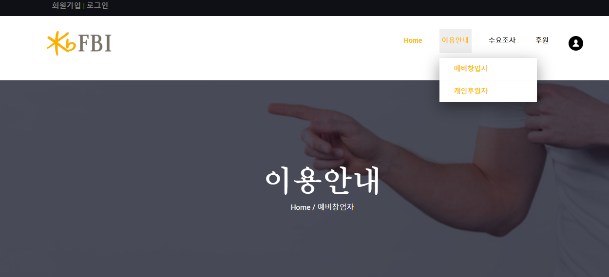

# FBI (매물 클라우드 펀딩 플랫폼)

## 1. 기술 스택

- JAVA (메인 개발 언어)

- Open API  
  - 상권 분석 API(https://www.data.go.kr/dataset/15017008/openapi.do)
  
- JSP, CSS, HTML : 웹 디자인, 개발에 사용
- ORACLE : 각 매물들의 정보와 상권분석 데이터들을 DB에 저장하기 위해서 사용.

  

  

## 2. 데이터베이스 

- DB 모델링

전체적인 DB 설계는 메인 BUILDING 테이블을 중심으로 투표, 코멘트, 유저정보, 투표 확인 용  등등의 디비들이 존재한다.  

## 3. 시연화면

### 기본 메인 화면 

수요조사 - 후원 항목의 3개의 매물들을 메인에 띄워서 바로 이동 가능하게 개발하였다.

### 이용안내 

이용안내는 예비창업자, 후원자를 구분하여 만듬.

### 수요조사

기본 소개 메세지와 함께 수요조사중인 건물들을 나열해서 보여줌.

### 수요조사 상세

수요조사 상세페이지에서는 

상권분석 API를 통해 얻은 정보로 활성도, 과밀도, 안정성, 성장성을 분석하여 별점으로 표시해서 보여줌.

또 가게의 사진, 지도정보, 투표정보, 댓글 정보등을 함께 보여준다.

### 후원 상세

후원 상세페이지에서도 

상권분석 API를 통해 얻은 정보로 활성도, 과밀도, 안정성, 성장성을 분석하여 별점으로 표시해서 보여줌.

또 가게 주인이 직접 서비스 소개란을 작성할 수 있게 개발하였다.

# 4. 개선사항

Spring과 같은 프레임워크를 사용하지 않았고, 첫 웹 개발이다보니 투박한 점이 많았다.

글자 폰트 같은 세심한 디자인을 놓쳐서 수정할 필요가 있다.

마이페이지와 로그인을 구현하여 자신이 투표한 건물들을 보여주려는 기능을 제공하고 싶었는데 사정상 마이페이지는 제외시켰다.

# 5. 느낀점

5월 10일에 멀티캠퍼스에서 처음 자바를 배우면서 웹 개발을 배웠는데, 약 한달정도 뒤에 바로 해커톤에 참여하게 되었다.

그래서 Spring이라던가 Mybatis라던가 프레임 워크에 대한 이해도 전혀 없었고 HTML과 CSS 정도 밖에 모르는 상태로 해커톤에 참여 하였고, JSP도 해커톤을 준비하면서 따로 공부를 하거나 질문을 해가며 공부를 해야하는 안 좋은 환경이었다.

그럼에도 기획안이 예선을 통과하여 해커톤에 참여할 수 있어서 좋았고, 다른 조들의 기획이나 발표를 보면서 더 잘하고 싶다는 자극을 받을 수 있었다.